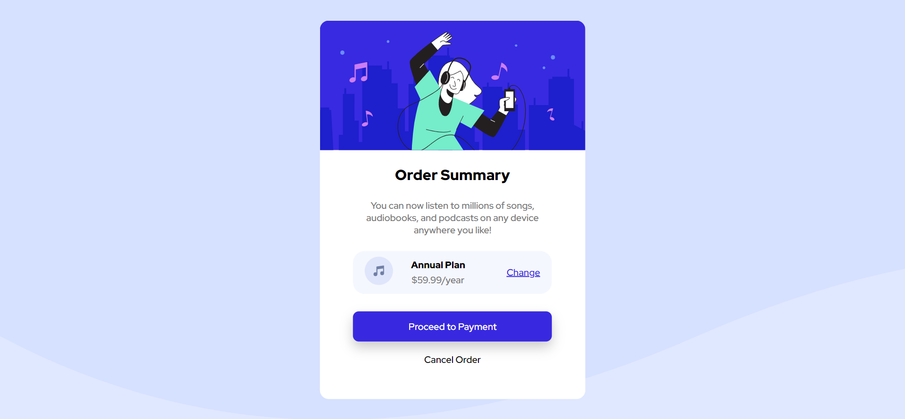

# Frontend Mentor - Order summary card solution

This is a solution to the [Order summary card challenge on Frontend Mentor](https://www.frontendmentor.io/challenges/order-summary-component-QlPmajDUj). Frontend Mentor challenges help you improve your coding skills by building realistic projects. 

## Table of contents

- [Overview](#overview)
  - [The challenge](#the-challenge)
  - [Screenshot](#screenshot)
  - [Links](#links)
- [My process](#my-process)
  - [Built with](#built-with)
  - [What I learned](#what-i-learned)
  - [Continued development](#continued-development)
  - [Useful resources](#useful-resources)
- [Author](#author)
- [Acknowledgments](#acknowledgments)

**Note: Delete this note and update the table of contents based on what sections you keep.**

## Overview

### The challenge

Users should be able to:

- See hover states for interactive elements

### Screenshot



### Links

- Solution URL: [Github](https://github.com/Odiesta/order-summary-component-main)
- Live Site URL: [Live](https://dainty-starburst-d16075.netlify.app/)

## My process

### Built with

- HTML5
- Sass

### What I learned

I learn using sass to be able to scale website as needed. i learn using BEM method to organize class into a group of similar things. for example

```html
<div class="plan__price">
  <p class="plan__price-primary">Annual Plan</p>
  <p class="plan__price-sub">$59.99/year</p>
</div>
```

Using Sass with BEM method making writing class easier

```css
.plan {
    &__price {
        margin-right: 4rem;

        &-primary {
            font-weight: 900;
            margin-bottom: .5rem;
        }
        
        &-sub {
            color: #777;
            font-weight: 500;
        }
    }
}
```

Using Sass i able to create different file to handle different task.

```css
@import "abstract/mixin";
@import "abstract/variable";
@import "base/base";
@import "base/typography";
@import "components/button";
@import "layout/layout";
```

I learn to write the good way of writing media query by using mixin

```css
@mixin respond($breakpoint) {
    @if $breakpoint == phone {
        @media (max-width: 37.5em) { @content };
    }
}
```


### Continued development

I plan to continue practicing my css and complete udemy course Advanced CSS and Sass: Flexbox, Grid, Animations and More!.

### Useful resources

- [CSS course](https://www.udemy.com/course/advanced-css-and-sass/) - This course help me on Sass, writing better css, and advanced stuff in css.

## Author

- Website - [Odiesta Shandikarona](https://github.com/Odiesta)
- Frontend Mentor - [@Odiesta](https://www.frontendmentor.io/profile/Odiesta)
- Twitter - [@OdiestaS](https://twitter.com/OdiestaS)
